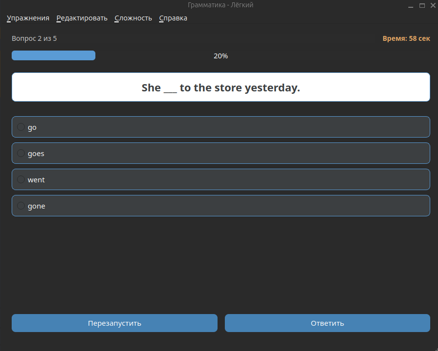
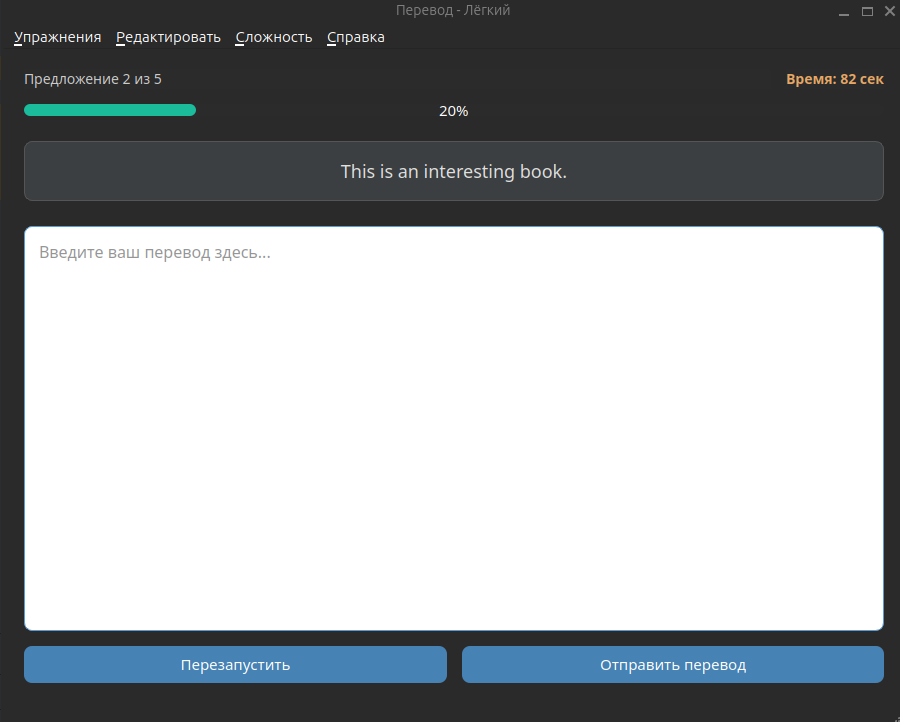
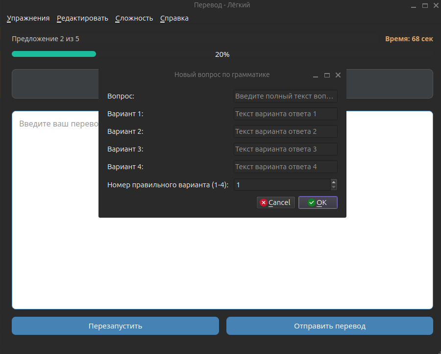
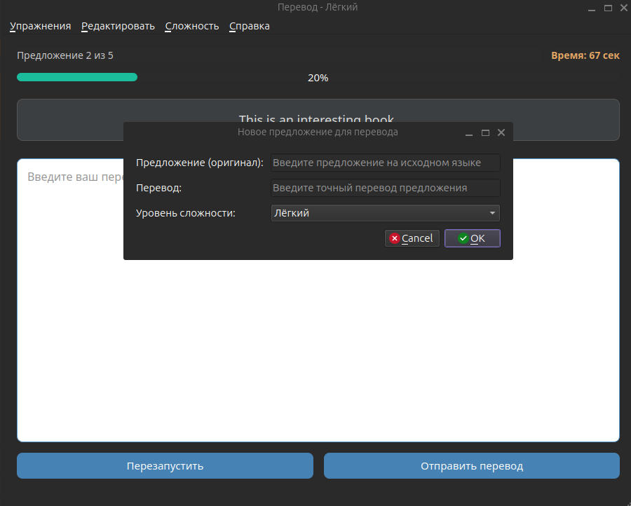
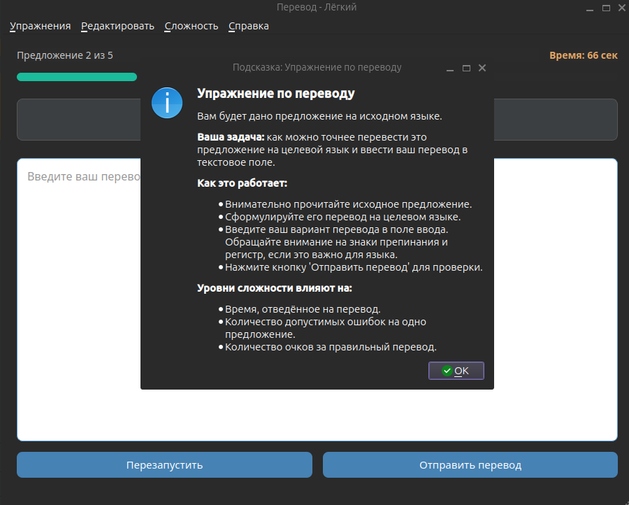
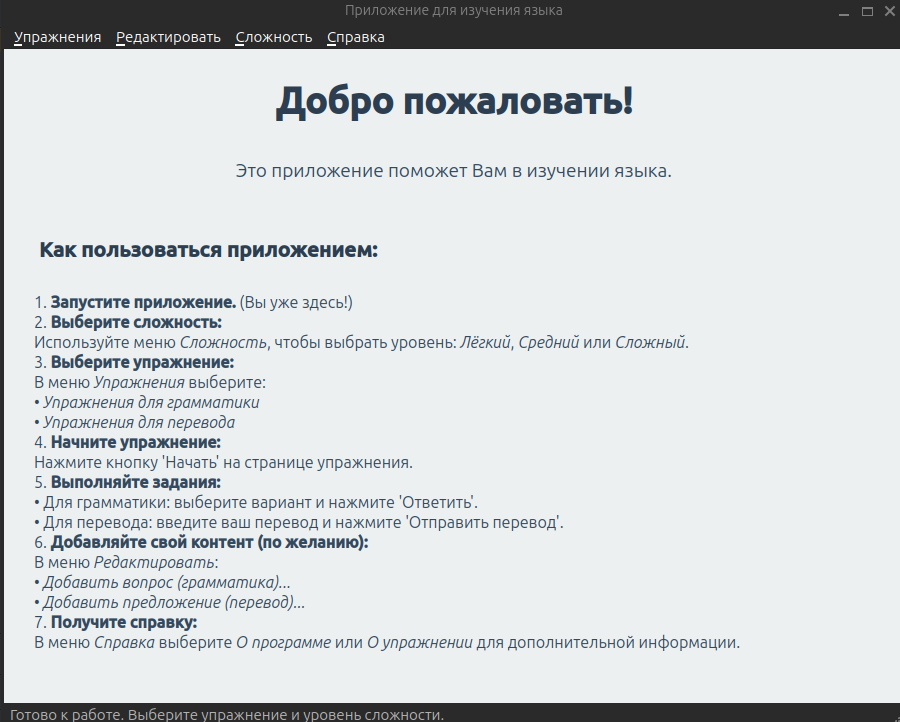

# Приложение для изучения языка (Language Learning App)

Простое десктопное приложение, созданное с использованием Qt (C++), предназначенное для помощи пользователям в изучении языка посредством грамматических упражнений и упражнений на перевод.

##  Возможности

*   **Упражнения по грамматике:** Вопросы с множественным выбором для проверки понимания грамматики.
*   **Практика перевода:** Переводите предложения с исходного языка на целевой.
*   **Уровни сложности:** Выбирайте между "Лёгким", "Средним" и "Сложным" режимами, которые влияют на:
    *   Время, отведённое на каждый вопрос/предложение.
    *   Количество попыток на каждый вопрос/предложение.
    *   Количество очков за правильные ответы.
*   **Пользовательский контент:** Добавляйте собственные вопросы по грамматике и предложения для перевода через меню "Редактировать".
*   **Задания на время:** Каждый вопрос/предложение имеет таймер, что стимулирует быстрое мышление.
*   **Отслеживание очков:** Следите за своей успеваемостью и накапливайте очки.
*   **Индикация прогресса:** Визуальные индикаторы выполнения показывают, насколько вы продвинулись в упражнении.
*   **Удобный интерфейс:** Интуитивно понятная навигация с панелью меню и отдельными страницами для упражнений.
*   **Интернационализация:** Поддерживает несколько языков для элементов интерфейса (текущие примеры на русском).

##  Скриншоты

  
  
  
  
  
  

## Использование

1.  Запустите приложение.
2.  **Выберите сложность:** Используйте меню "Сложность", чтобы выбрать между "Лёгкий", "Средний" или "Сложный".
3.  **Выберите упражнение:**
    *   Перейдите в "Упражнения" -> "Упражнения для грамматики".
    *   Или перейдите в "Упражнения" -> "Упражнения для перевода".
4.  **Начните упражнение:** Нажмите кнопку "Начать".
5.  **Отвечайте на вопросы / переводите предложения:**
    *   Для грамматики выберите вариант и нажмите "Ответить".
    *   Для перевода введите ваш перевод и нажмите "Отправить перевод".
6.  **Добавление контента:**
    *   Перейдите в "Редактировать" -> "Добавить вопрос (грамматика)...", чтобы добавить новый вопрос по грамматике.
    *   Перейдите в "Редактировать" -> "Добавить предложение (перевод)...", чтобы добавить новое предложение для перевода.
7.  **Просмотр справки:** Зайдите в "Справка" -> "О программе" или "Об упражнении" для информации о приложении.

## Структура проекта (ключевые файлы)

*   `main.cpp`: Главная точка входа приложения.
*   `mainwindow.h/.cpp`: Главное окно приложения, обработка меню, управление страницами.
*   `grammar.h/.cpp`: Логика и UI для грамматических упражнений.
*   `translation.h/.cpp`: Логика и UI для упражнений на перевод.
*   `addgrammardialog.h/.cpp`: Диалог для добавления грамматических вопросов.
*   `addtranslationdialog.h/.cpp`: Диалог для добавления предложений для перевода.
*    Структуры (`Question`, `Sentence`) определены в соответствующих заголовочных файлах.

## Сборка и запуск

